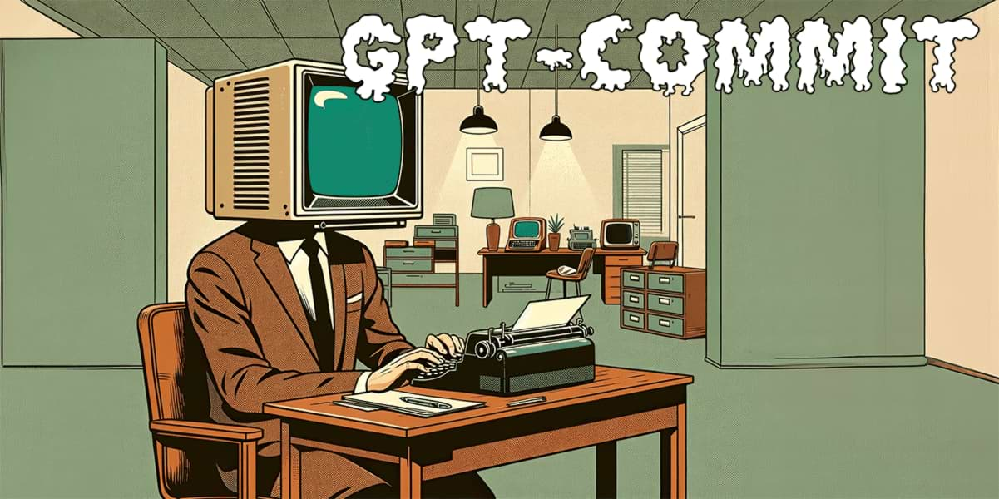

## gpt-commit-message

*image_caption*
# OpenAI Commit Message Generator
A command line tool that uses the OpenAI API to generate succinct commit messages with as much detail as possible, using no more than 50 characters.

## Getting Started
1. Install dependencies: `npm install`
2. Set your OpenAI API Key: `export OPENAI_API_KEY=<YOUR_API_KEY>`
3. Run the program: `node index.js`

## Usage
The program will prompt for a summary of the code changes and will generate a suggested commit message based on the input. You can then choose to use the generated message or cancel the commit.
